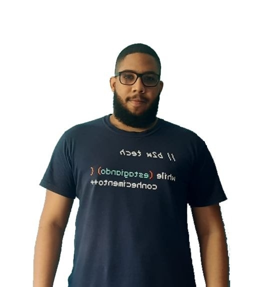

<h1>Futebol do Futuro - Projeto FrontEnd</h1> 

   
   
   

### Tópicos 

:small_blue_diamond: [Descrição do projeto](#descrição-do-projeto)

:small_blue_diamond: [Estruturas](#estruturas)

:small_blue_diamond: [Integrantes](#integrantes)

... 

## Descrição do projeto 

  O nosso projeto criar um site para uma organização dedicada a oferecer oportunidades para jovens praticarem futebol, promovendo a inclusão social e o desenvolvimento de habilidades pessoais e coletivas. Buscamos englobar 3 dos Objetivos do Desenvolvimento Sustentável: ODS 3: Saúde e Bem-Estar, ODS 4: Educação de Qualidade e ODS 10: Redução das Desigualdades.

## Estruturas

:heavy_check_mark: 3 Páginas na Raiz do Projeto (Index.html, Login.html e Cadastro.html)  

:heavy_check_mark: Pasta Figs onde contém as Imagens e Icones do Projeto  

:heavy_check_mark: Pasta CSS onde contém o arquivo Styles.css para estilização do projeto.  

:heavy_check_mark: Este Readme de informativo  

## Integrantes :dash:

| [ Ricardo Henrique](https://github.com/ricardohsousa) |